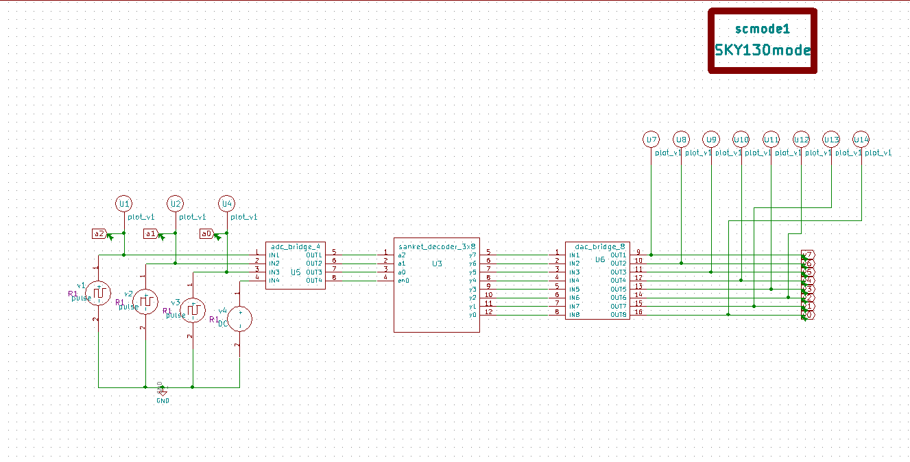
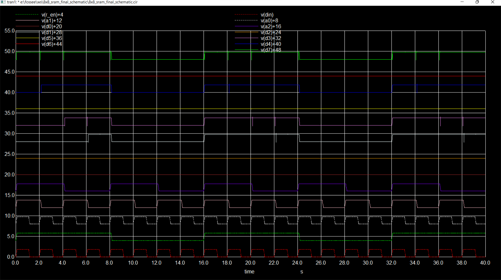

# 8X8-SRAM-Mixed-Signal-Design
A mixed-signal design for an 8X8 SRAM, as well as additional bit addressable RAM implementation, are both included in this repository. They were designed using eSim and NgVeri..

# Table of Contents:
 * [Abstract](#Abstract)
 * [Introduction](#Introduction)
 * [Components for 8x8 SRAM](#Components-for-8x8-SRAM)
 * [6T SRAM Cell](#6T-SRAM-Cell)
 * [3X8 Decoder](#3X8-Decoder)
 * [Writer Circuit](#Writer-Circuit)
 * [Sensor Circuit](#Sensor-Circuit)
 * [Simulation Tools Used](#Simulation-Tools-Used)
 * [Schematics and Simulations](#-Schematics-and-Simulations)
   * [Schematics](#Schematics)
   * [Simulations](#Simulations)
 * [Netlist of the Circuits](#Netlist-of-the-Circuits)
 * [Author](#Author)
 * [Acknowledgements](#Acknowledgements)
 * [References](#References)
 
 # Abstract:
 SRAM forms a storage element in VLSI chips due to their large storage density and small access time. The Scope of the work is to design a 6 transistor SRAM cell along with a 3x8 Decoder and finally integrating the analog block along with digital block to form a mixed signal based 8x8 SRAM.
 
 # Introduction:
 Memory components are particularly significant in contemporary computers for storing vast quantities of data. Because we all know that SRAM is considerably quicker than DRAM, we have the notion of caching the memory, which means that we save the data in SRAMs on the initial load so that the subsequent load time is greatly reduced. The key benefits of employing SRAM are its fast switching speed and low power usage. This circuit's uses include a basic memory element, a Lookup table for an FPGA, and so on. Because servers are normally turned on all the time, SRAMs are commonly employed in server-based online applications. Because the use of this SRAM is projected to develop further, we will create an 8x8-Bit SRAM-based cache memory that will be primarily employed due to its high performance and low power consumption in contrast to DRAM.
 
 
 # Components for 8x8 SRAM:
 The needed components are a 3X8 Decoder built in the digital domain using NgVeri, a 1-bit RAM cell with a writer circuit, a 6T RAM cell, and a sensing circuit all implemented in the analog domain using eSIM. Cascaded 8 SRAMs are used to build an 8 bit RAM row. To choose the 8-bit RAM row that we want to execute the read/write operation to, we will utilise the 3X8 Decoder.The following is the architecture of 1 BIT SRAM.
 <p align="center">
  </br>
  Fig:SRAM Block Diagram:
</p>
 
 # 6T SRAM Cell
The proposed design of SRAM is made of 6 transistors, pins associated with the design are BL,BLB,WL.WL pin is used to control Read/Write and Hold operation. BL,BLB are used to read and write bit to the ram cell.The value in the BL, BLB is sent to the opposite sides of the inverter network, overriding the already existent value, when the wl is high, turning on the N-MOSFETs on each side of the latching inverters. The value in the inverter network continues to hold after the N-MOSFETs are turned off until the inverter network receives power.
<p align="center">
  </br>
  Fig:6T SRAM Cell Schematic:
</p>

# 3X8 Decoder:
Decoder in digital electronics does the job of decoding based on the input data. Decoder on n input will have 2^n outputs. The output is purely base on the combinational logic inside it. In this paper Decoder will be representing the digital block of mixed signal Design.
<p align="center">
  </br>
  Fig:3x8 Decoder and Truth table:
</p>
The eSIM simulator's MakerChip capability has been used in this design to create the aforementioned decoder. Open the MakerChip tab on the left after launching eSIM , then load the Verilog code file. Using the MakerChip EDA tool coupled with the eSIM tool, we can test the operation of the loaded verilog code. The verilog code may then be translated into a NgSpice netlist by switching to the NgVeri tab. The aforementioned decoder's verilog code is as follows:

```
  module SANKET_decoder_3x8(y,a,en);
  input [2:0]a;
  input en;
  output reg [7:0]y;
  always @(a) 
    begin
      if(en==1)
        begin
          y[0] = !a[0] & !a[1] & !a[2];
          y[1] = a[0] & !a[1] & !a[2];
          y[2] = !a[0] & a[1] & !a[2];
          y[3] = a[0] & a[1] & !a[2];
          y[4] = !a[0] & !a[1] & a[2];
          y[5] = a[0] & !a[1] & a[2];
          y[6] = !a[0] & a[1] & a[2];
          y[7] = a[0] & a[1] & a[2];
        end
      else y = 8'b00000000;
    end
  endmodule
```

# Writer Circuit:
The input for the 6T SRAM cell is provided by this circuit. This block's functionality is to provide the SRAM cell with bl and blb, if the inputs wl and din are high, bl and blb will likewise be high otherwise, both outputs will be low. The NgVeri function of the eSIM was used in this design to create the Writer Circuit. The Verilog code looks like this:

```
  module SANKET_WRITE_CKT(bl,blb,wl,din);
    input wl,din;
    output reg bl,blb;
    always @(wl,din) begin
      bl = wl & din;
      blb = !bl;
    end
  endmodule
```
# Sensor Circuit
The SRAM cell's data may be read using this circuit. A Read Enable(r en) pin on the device outputs the value stored in the SRAM cell when it is high.

# Simulation Tools Used:
•  eSim: FOSSEE, IIT Bombay, created the Open Source EDA. It is applied to the modelling of electrical circuits. NgSpice and KiCAD, two pieces of software, were combined to create it. Further information<a href='https://www.esim.fossee.in/'>Refer here</a></br>

• NgSpice: It is an Open Source Software for Spice Simulations. For more details<a href='http://ngspice.sourceforge.net/docs.html'>Refer here</a></br>

• Makerchip: It is an Online Web Browser IDE for Verilog/System-verilog/TL-Verilog Simulation. <a href='https://www.makerchip.com/'>Refer here</a></br>

• Verilator: It is a tool which converts Verilog code to C++ objects. <a href='https://www.veripool.org/verilator/'>Refer here</a></br>

# Schematics and Simulations:

## Schematics:

### 3:8 Decoder:
The component will be listed under "eSim Ngveri" as the module name we specified after the NgSpice netlist has been built as previously said. The ADC and DAC bridges, which are offered by eSim under the "eSim Hybrid" and may be chosen based on the number of inputs and outputs needed, are what are needed to replicate this digital block in the analogue environment. The schematic displayed below will be created if the aforementioned procedures are followed:
<p align="center">
  </br>
  Fig: 3:8 Decoder Schematic:
</p>

### 6T SRAM cell:
We may choose the MOSFETS for this circuit from the list of "eSim Devices" in the schematic, connect the circuit as indicated, annotate the components, run an electrical rules check, and produce a netlist to finish the schematic. The schematic should then be created using the eSIM's Sub-circuit tool without sources and with the pins replaced with ports. After generating the netlist, build the symbol.
<p align="center">
  </br>
  Fig: SRAM Symbol:
</p>
<p align="center">
  </br>
  Fig7: 6T SRAM Schematic:
</p>

### 1-BIT SRAM Cell:
Similar to how a decoder is built, so is a writer circuit. After designing the schematics and symbols for the 6T SRAM and writer circuits, I connected all the parts to get the schematic shown below. The circuit may then be turned into a symbol utilising the Sub-Circuit features when the functionality has been confirmed. The schematic and symbol will appear as follows:
<p align="center">
  </br>
  Fig: 1-Bit SRAM Symbol:
</p>
<p align="center">
  </br>
  Fig: 1-Bit SRAM Schematic:
</p>

### SRAM Row:
Using 1-BIT SRAM Cell previously created as sub circuit SRAM row is designed. It is cascaded form of 8 1-BIT SRAM Cells, it forms a Byte storege element. Further these rows can be used to create nx8 SRAM .
<p align="center">
  </br>
  Fig: SRAM Row Symbol:
</p>
<p align="center">
  </br>
  Fig: SRAM Row Schematic:
</p>

### 8x8 SRAM Schematic:
We link the Decoder and the  SRAM rows as illustrated in the schematic to produce the 8x8-Bit SRAM after creating all of the aforementioned symbols. The SRAM cell is chosen and the read/write operation is carried out based on the input provided to the decoder.
<p align="center">
  </br>
  Fig: 8x8 SRAM Schematic:
</p>

## Simulations:

### 3X8 Decoder:
Return to eSim after creating the design and producing the netlist, choose the KiCAD to NgSpice converter and provide the necessary parameters to convert the current circuit to NgSpice. After completing the above procedures, run the simulation to obtain the following results:
<p align="center">
  </br>
  Fig: Transient Analysis of 3X8 Decoder:
</p>
<p align="center">
  </br>
  Fig: MakerChip Analysis of 3X8 Decoder:
</p>

### 6T SRAM Cell:
<p align="center">
  </br>
  Fig: Test Schematic of 6T SRAM Cell:
</p>
<p align="center">
  </br>
  Fig: Transient Analysis of 6T SRAM Cell:
</p>

### 1-Bit SRAM Cell:
Return to eSim after creating the design and producing the netlist, choose the KiCAD to NgSpice converter and provide the necessary parameters to convert the current circuit to NgSpice. After completing the above procedures, run the simulation to obtain the following results:
<p align="center">
  </br>
  Fig: Test Schematic of 1-Bit SRAM Cell:
</p>
<p align="center">
  </br>
  Fig: Transient Analysis of 1-Bit SRAM Cell:
</p>

### SRAM Row:
<p align="center">
  </br>
  Fig. 13: Test Schematic SRAM Row:
</p>
<p align="center">
  </br>
  Fig. 13: Transient Analysis of SRAM ROW:
</p>

### 8x8 SRAM:
<p align="center">
  </br>
  Fig. 13: Transient Analysis of 8x8 SRAM:
</p>


# Netlist of the Circuits:
• Refer to the netlist of the 3X8 Decoder here: <a href='3x8DECODER_TEST/3x8DECODER_TEST.cir.out'>Netlist</a></br>

• Refer to the netlist of the 6T SRAM Cell here: <a href='SRAM_CELL_TEST/SRAM_CELL_TEST.cir.out'>Netlist</a></br>

• Refer to the netlist of the 1-Bit SRAM here: <a href='SRAM_1BIT_TEST/SRAM_1BIT_TEST.cir.out'>Netlist</a></br>

• Refer to the netlist of the SRAM Row here: <a href='SRAM_8BIT_TEST/SRAM_8BIT_TEST.cir.out'>Netlist</a></br>

• Refer to the netlist of the 8x8 SRAM here: <a href='8X8_SRAM_FINAL_SCHEMATIC/8X8_SRAM_FINAL_SCHEMATIC.cir.outt'>Netlist</a></br>

# Author:
• Sanket M Mantrashetti, B.Tech(ECE),RV College Of Engineering, Banglore - 560059.

# Acknowledgements:
• <a href='https://www.vlsisystemdesign.com/'>VLSI System Design (VSD) Corp. Pvt. Ltd India</a></br>
• <a href='https://www.esim.fossee.in/'>FOSSEE Team, IIT Bombay</a></br>
• <a href='https://www.google.co.in/'>Google</a></br>
• <a href='https://www.esim.fossee.in/'>Indian Institute of Technology Bombay</a></br>
• <a href='https://spoken-tutorial.org/'>Spoken Tutorial</a></br>
• <a href='https://www.c2s.gov.in/'>Ministry of Electronics & Information Technology (MeitY)
Chips to Startup (C2S)</a></br>

# References:
1.https://www.ijera.com/papers/Vol4_issue3/Version%201/CX4301574577.pdf
2.https://ieeexplore.ieee.org/abstract/document/4140596
3.https://ieeexplore.ieee.org/abstract/document/4798182
4.https://www.iosrjournals.org/iosr-jvlsi/papers/vol8-issue1/Version-1/E0801014346.pdf

